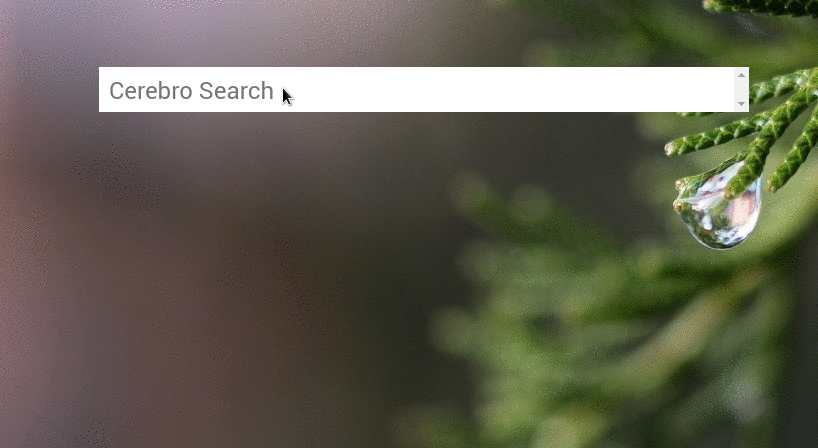

# Cerebro-cnsjs

> Cerebro plugin for searching in [cdnjs.com](https://cdnjs.com/). It uses [cdnjs-api](https://www.npmjs.com/package/cdnjs-api) node package.



## Usage

Type ```cdn <searchterm>``` in your cerebro box.
A list of packages matching your search criteria will be displayed. Clicking on a result it will copy the library url to the clipboard. By clicking "Ctrl + Enter" it will open the respective library details page on cdnjs.com in your default brower.

## Related

* [Cerebro](http://github.com/KELiON/cerebro) – Plugin extracted from core Cerebro app;
* [cerebro-plugin](http://github.com/KELiON/cerebro-plugin) – boilerplate to create Cerebro plugins;
* [cdnjs](https://cdnjs.com/)
* [alfred-cdn-workflow](https://github.com/willfarrell/alfred-cdn-workflow) - Check which CDNs a package is hosted on.

## License

MIT © [Bruno Paz](http://brunopaz.net)
